# How we pointed `ashanandanvan.com.au` at Azure App Service

This is the working runbook for the **dev** site. Use it if you buy another domain, move the app, or have to redo DNS.

| Item | Value we used |
|---|---|
| Registrar / DNS | [Cheaper Domains](https://www.cheaperdomains.com.au/) |
| Domain | `ashanandanvan.com.au` |
| Azure resource group | `ashanandanvan-dev` |
| App Service | `app-ashanandanvan-dev` |
| Default Azure URL | `https://app-ashanandanvan-dev.azurewebsites.net` |
| App Service plan | `plan-ashanandanvan-dev` — **B1 Basic, Linux**, Australia East |
| Public site | `https://www.ashanandanvan.com.au` and `https://ashanandanvan.com.au` |

Email stays on Cheaper Domains. Do **not** change MX, SPF, DMARC, `mail`, `autodiscover`, or `webmail`.

---

## What the DNS words mean

| Record | What it does | We used it for |
|---|---|---|
| **A** | “This name is this IPv4 address.” | Root name `ashanandanvan.com.au` → App Service inbound IP |
| **CNAME** | “This name is an alias of that other name.” | `www` → `app-ashanandanvan-dev.azurewebsites.net` |
| **TXT** (Cheaper Domains calls it **TXT/SPF**) | A text token Azure reads to prove you own the domain | `asuid` and `asuid.www` |

Rules that bit us:

- A hostname can have **only one CNAME**. Two `www` CNAMEs fail.
- The **root** name (`ashanandanvan.com.au`) cannot be a CNAME if you also need MX for email. Use an **A** record for the root.
- `www` and the root are **two different hostnames**. Azure needs both added, and each needs its own SSL binding.

---

## 0. Scale the App Service plan to B1

**Free (F1) cannot bind a custom domain.** We scaled the live plan to **B1 Basic** (~A$19–20/month in Australia East) and set the same SKU in `infra/modules/webapp.bicep` so the next GitHub deploy does not put it back on F1.

1. Azure Portal → **App Service** `app-ashanandanvan-dev` → **Scale up (App Service plan)**.
2. Choose **Basic B1** → **Select**.
3. Confirm `infra/modules/webapp.bicep` has `sku.name: 'B1'` (already done in this repo).

`alwaysOn` stays **off** on B1 to keep cost down.

---

## 1. Copy two values from Azure

Open **App Service** → **Custom domains**.

Copy and keep:

1. **IP address** — we used `20.211.64.26` for the root **A** record. The portal may also show a second inbound IP (ours also listed `4.147.196.209`). If Azure later fails A-record validation, add a **second A** for the root pointing at that extra IP. Do not replace the first A unless Azure tells you the old IP is gone.
2. **Custom Domain Verification ID** — a long hex string. Azure wants this in two TXT records (`asuid` and `asuid.www`).

The verification ID is also public in DNS. Copy the **current** value from the portal; it can change if the app is recreated.

---

## 2. Open DNS at Cheaper Domains

1. Sign in at cheaperdomains.com.au.
2. **Domains** → `ashanandanvan.com.au` → **View** / DNS / Manage records.

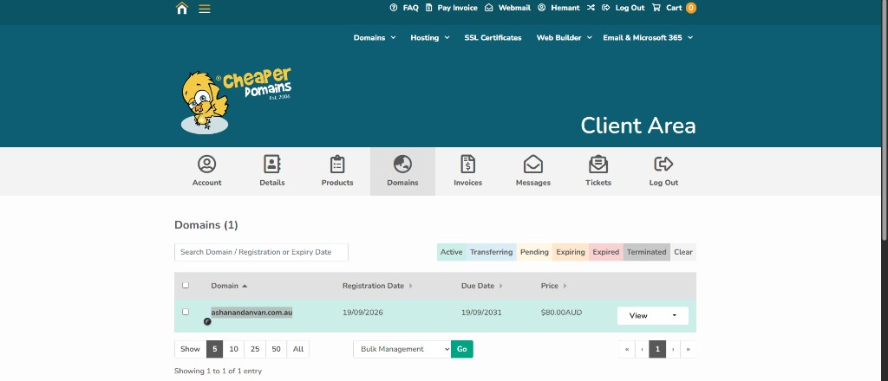

Cheaper Domains has **no plain TXT** type. Use **TXT/SPF** for Azure `asuid` records **and** for the existing SPF / DMARC rows.

Hostname field: type only the **left** part (`www`, `asuid`, `asuid.www`). Leave it blank for the root (`@` / `ashanandanvan.com.au`). Do not type the full domain into Hostname.

---

## 3. Remove parking records (required)

The domain shipped with Cheaper Domains parking. Those records block Azure.

### 3a. Error if you add a second `www` CNAME

We first tried to add `www` → `app-ashanandanvan-dev.azurewebsites.net` while a parking CNAME still existed. Cheaper Domains rejected it:

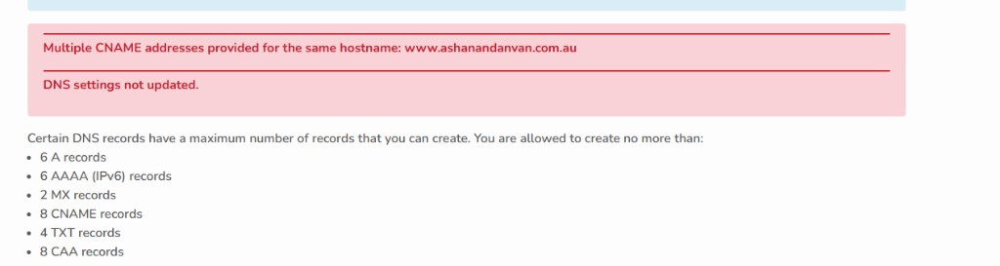

**Parking `www` CNAME — delete this:**

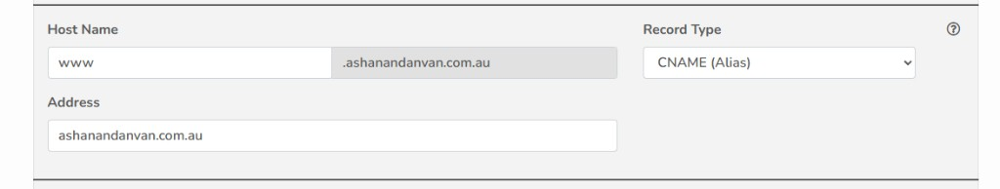

| Hostname | Type | Address | Action |
|---|---|---|---|
| `www` | CNAME | `ashanandanvan.com.au` | **Delete** |

### 3b. Parking root A record — delete this

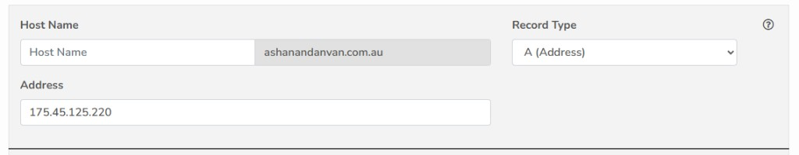

| Hostname | Type | Address | Action |
|---|---|---|---|
| *(blank / @)* | A | `175.45.125.220` | **Delete** |

Leave **`webmail` A → `175.45.125.220`**. That is Cheaper Domains webmail, not the website.

---

## 4. Add the four Azure DNS records

Add **new** rows. Do not edit MX, SPF, DMARC, `mail`, `autodiscover`, or `webmail`.

### 4a. Verification TXT (type **TXT/SPF**)

Paste the **Custom Domain Verification ID** from Azure into **Address**. Same value twice.

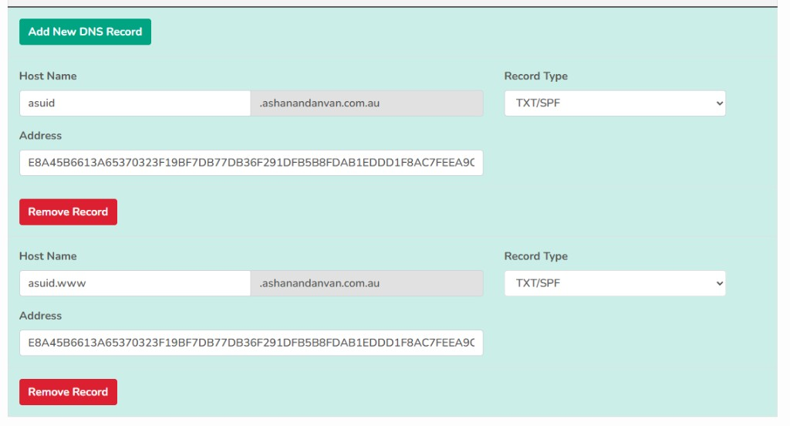

| Hostname | Type | Address |
|---|---|---|
| `asuid` | TXT/SPF | *(verification ID from Azure)* |
| `asuid.www` | TXT/SPF | *(same verification ID)* |

### 4b. Website records

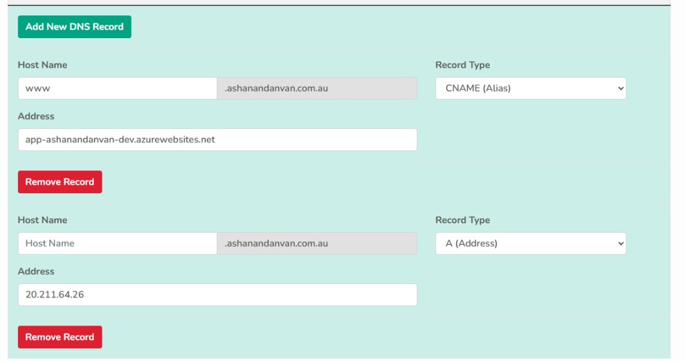

| Hostname | Type | Address |
|---|---|---|
| `www` | CNAME | `app-ashanandanvan-dev.azurewebsites.net` |
| *(blank / @)* | A | `20.211.64.26` *(IP from Custom domains)* |

No trailing dot needed in Cheaper Domains. Save.

DNS can take a few minutes. Azure Validate is the real check; you do not need to wait a full TTL if Validate already passes.

---

## 5. Final Cheaper Domains zone (what “good” looks like)

These screenshots are the zone after cleanup. Email rows stay; Azure rows are added.

**Root A (site), MX and SPF — keep MX and SPF as they are:**

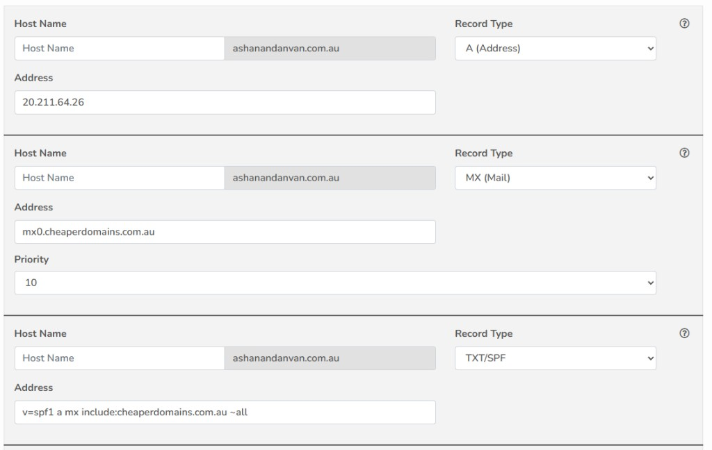

**DMARC, both `asuid` records, autodiscover:**

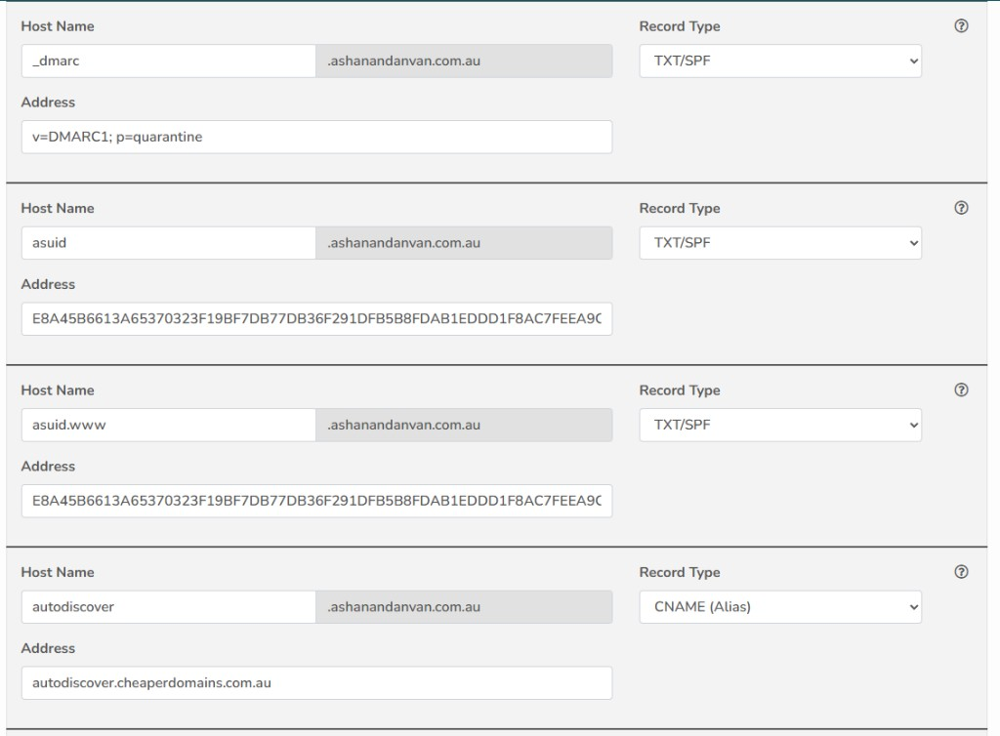

**mail, webmail, www CNAME:**

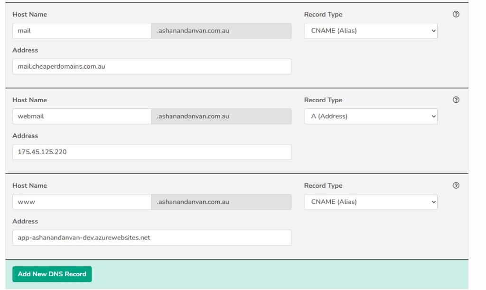

### Checklist

| Hostname | Type | Address | Keep / ours |
|---|---|---|---|
| *(blank)* | A | `20.211.64.26` | Azure site |
| *(blank)* | MX | `mx0.cheaperdomains.com.au` (priority 10) | **Keep — email** |
| *(blank)* | TXT/SPF | `v=spf1 a mx include:cheaperdomains.com.au ~all` | **Keep — email** |
| `_dmarc` | TXT/SPF | `v=DMARC1; p=quarantine` | **Keep — email** |
| `asuid` | TXT/SPF | Azure verification ID | Azure prove-ownership |
| `asuid.www` | TXT/SPF | Azure verification ID | Azure prove-ownership |
| `autodiscover` | CNAME | `autodiscover.cheaperdomains.com.au` | **Keep — email** |
| `mail` | CNAME | `mail.cheaperdomains.com.au` | **Keep — email** |
| `webmail` | A | `175.45.125.220` | **Keep — email** |
| `www` | CNAME | `app-ashanandanvan-dev.azurewebsites.net` | Azure site |

---

## 6. Add `www` in Azure (CNAME hostname)

1. Azure → `app-ashanandanvan-dev` → **Custom domains** → **Add custom domain**.
2. **Domain provider:** **All other domain services**.
3. Domain: `www.ashanandanvan.com.au`.
4. Hostname record type: **CNAME**.
5. **Validate** → **Add**.

You can choose **Add certificate later**. Binding is the next step.

### Trap: Add stays greyed out

If **Domain provider** is **App Service Domain**, Azure looks for a domain it sold you. This subscription has none, so **Add** stays disabled.

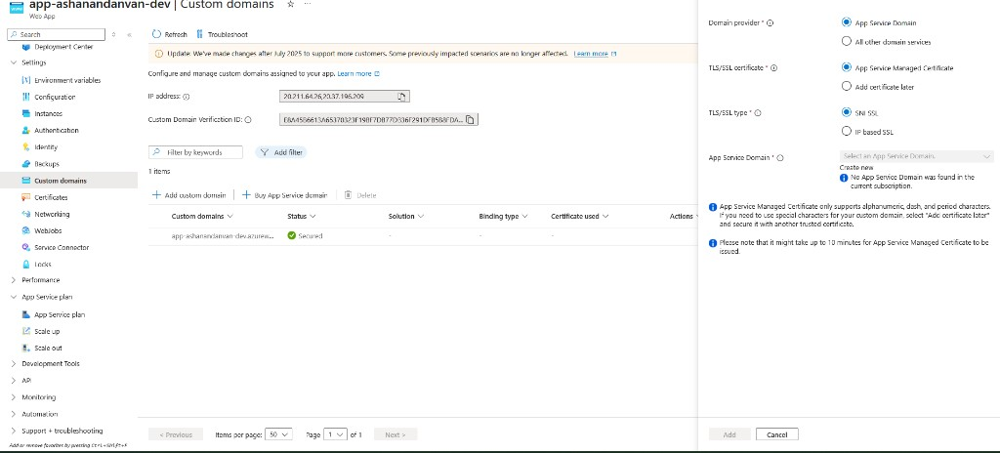

Switch to **All other domain services**, then the domain box and **Add** work.

---

## 7. Bind HTTPS for `www` (this is what “No binding” means)

After Add, the `www` row is present but **Status = No binding** and the action is **Add binding**. That is normal. Azure accepted the hostname; it does not have a certificate yet.

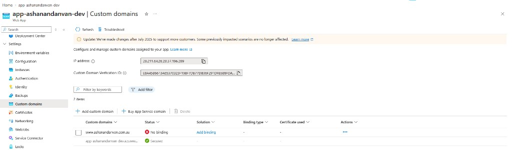

1. On the `www` row click **Add binding**.
2. **TLS/SSL type:** **SNI SSL** (not IP based).
3. **Source:** **Create App Service Managed Certificate** (free).
4. Domain validation should show green ticks on the `www` CNAME and `asuid.www` TXT.
5. Click **Add** (not Validate again, unless Add is disabled).

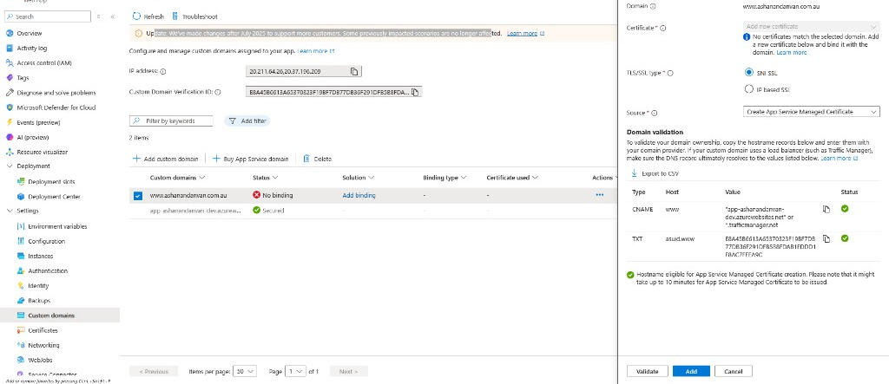

Azure says the managed certificate can take **up to 10 minutes**. Refresh **Custom domains**. The `www` row should become **Secured**, binding type **SNI SSL**.

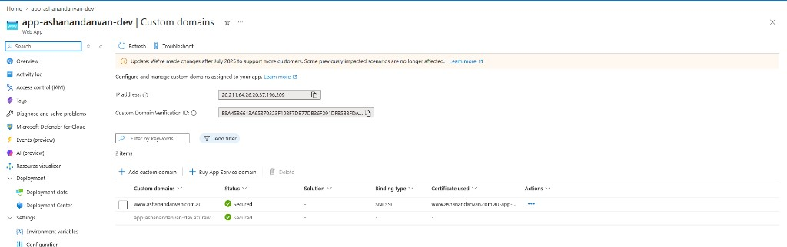

`https://www.ashanandanvan.com.au` should load with a lock:

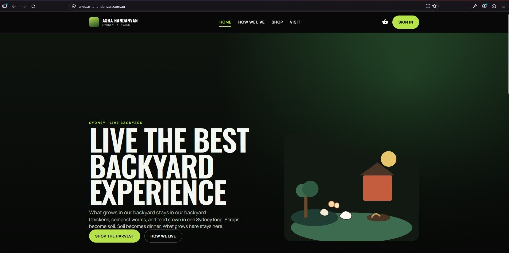

---

## 8. Repeat for the root name (A record)

`www` and `ashanandanvan.com.au` are separate. Do the same two Azure actions for the apex.

### 8a. Add the hostname

1. **Add custom domain** again.
2. **All other domain services**.
3. Domain: `ashanandanvan.com.au` — **no** `www`.
4. Hostname record type: **A**.
5. **Validate** → **Add**.

If Validate fails on the A record, add a second A in Cheaper Domains for the root pointing at the extra inbound IP shown on Custom domains (we saw `4.147.196.209`). Keep the existing A to `20.211.64.26`.

### 8b. Bind the certificate

On the new `ashanandanvan.com.au` row:

1. **Add binding**.
2. **Create App Service Managed Certificate**.
3. **SNI SSL**.
4. **Add**, then wait until the row says **Secured**.

Then open `https://ashanandanvan.com.au` as well as `https://www.ashanandanvan.com.au`.

---

## 9. Google Sign-in and Square

The browser URL is now the custom domain. Google and Square must allow those exact HTTPS URLs (scheme, host, path).

### Google Cloud Console

**APIs & Services → Credentials →** OAuth client **Shop - Asha Nandanvan**.

Add (keep the existing localhost and `azurewebsites.net` entries):

**Authorized JavaScript origins**

- `https://www.ashanandanvan.com.au`
- `https://ashanandanvan.com.au`

**Authorized redirect URIs**

- `https://www.ashanandanvan.com.au/signin-google`
- `https://ashanandanvan.com.au/signin-google`

Also keep:

- `https://localhost:7095/signin-google` (host F5)
- `http://localhost:8080/signin-google` (Docker web)
- `https://app-ashanandanvan-dev.azurewebsites.net/signin-google`

Then test **Sign in** on the live site.

The app already forces the HTTPS scheme behind App Service (`ASPNETCORE_FORWARDEDHEADERS_ENABLED` plus the Production scheme fix in `Program.cs`). Without that, Google saw `http://…` and failed with `redirect_uri_mismatch`.

### Square Developer Dashboard

Add the same two HTTPS site origins / return URLs the checkout uses. Place a small sandbox order if payments are enabled.

---

## 10. What we did not buy

- No SSL from Cheaper Domains. Azure **App Service Managed Certificate** is free on B1 and renews itself.
- No Azure App Service Domain. The name stays at Cheaper Domains.
- No change to Cheaper Domains nameservers.

---

## Troubleshooting (problems we actually hit)

| Symptom | Cause | Fix |
|---|---|---|
| Custom domain controls missing / not allowed | Plan is F1 | Scale to B1; keep Bicep on B1 |
| `Multiple CNAME addresses provided for the same hostname: www` | Parking `www` CNAME still there | Delete `www` → `ashanandanvan.com.au`, keep only the Azure CNAME |
| Azure Validate fails on A | Root still points at parking `175.45.125.220`, or IP is stale | Root A must be the App Service inbound IP; optional second A for the extra portal IP |
| **Add** disabled on Add custom domain | **App Service Domain** radio selected | Choose **All other domain services** |
| Status **No binding** | Hostname added, no cert yet | **Add binding** → managed cert → SNI → wait up to 10 minutes |
| Browser cert warning on the custom host | Binding not **Secured** yet | Wait or re-add the managed certificate |
| Google `redirect_uri_mismatch` | Console missing the exact `https://…/signin-google` | Add both www and apex URIs; do not mix `http` / `https` |
| Email breaks after DNS edits | MX / SPF / `mail` / `autodiscover` / `webmail` changed | Restore the **Keep — email** rows in the table above |

---

## If you recreate the web app

1. New default hostname (e.g. `app-…azurewebsites.net`) → update the **www CNAME**.
2. New inbound IP → update the root **A** record.
3. New **Custom Domain Verification ID** → update both `asuid` TXT/SPF records.
4. Repeat Azure **Add custom domain** + **Add binding** for `www` and the apex.
5. Update Google and Square URLs.
